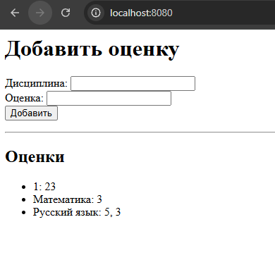
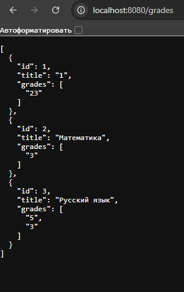

## Цель

Написать простой веб‑сервер для обработки **GET** и **POST** HTTP‑запросов с использованием библиотеки **socket**.  
Сервер должен уметь сохранять и отображать оценки по дисциплинам:

- через POST‑запрос добавляется дисциплина и оценка;
- через GET‑запрос отдаются все оценки в виде HTML‑страницы или JSON.

## Выполнение

В этой задаче я реализовал полноценный класс `MyHTTPServer`, который работает поверх TCP‑сокетов и вручную разбирает HTTP‑запросы.  
Сервер запускается на указанном хосте и порту, принимает соединения (`accept()`), парсит заголовки и тело запроса, а затем вызывает соответствующий обработчик в зависимости от URL и метода (роутинг).

**Основные возможности:**

- При `GET /` сервер отдаёт HTML‑страницу с формой для добавления новой оценки и списком уже существующих.
- При `POST /set_subject` сервер принимает данные формы (`title` и `grade`) и сохраняет их. Если дисциплина уже существует, новая оценка добавляется в список. Данные сохраняются в JSON‑файл `grades.json`.
- При `GET /grades` сервер возвращает все данные в формате JSON.

Чтобы избежать одновременной записи в файл из разных потоков, я использовал `threading.Lock`. Загрузка и сохранение данных вынесены в отдельные методы `_load_data()` и `_save_data()`.

Таким образом, сервер обрабатывает как GET‑, так и POST‑запросы и может работать в многопоточной среде: каждый клиент обслуживается отдельным потоком.

## Результат

При заходе в браузер по адресу сервера (http://localhost:8080/) пользователь видит HTML‑страницу с формой:

поле для названия дисциплины;

поле для оценки;

кнопку «Добавить».

После добавления данные отображаются списком:

```
Математика: 5, 4
Информатика: 3
```




## Вывод

Реализован простой веб‑сервер на Python, который вручную разбирает HTTP‑запросы и формирует корректные HTTP‑ответы.
Сервер умеет работать с формами (POST), хранить данные в JSON‑файле и возвращать результаты как в виде HTML‑страницы, так и в виде JSON‑объекта.
Это демонстрирует базовые принципы работы веб‑серверов без использования сторонних библиотек (Flask/Django).
